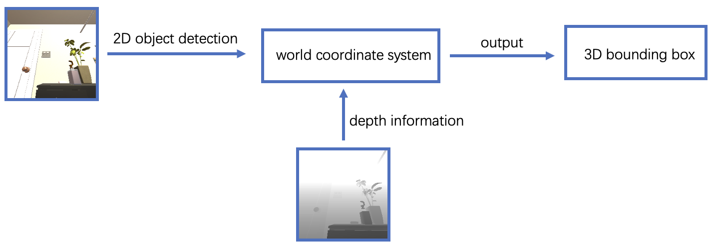

# Rearrange_3D_Bounding_Box
## Contents
- [Description](#Description)
- [Pipeline](#Pipeline)
- [Install](#Install)
- [Run](#Run)

## Description <a name="Description"></a>

## Pipeline <a name="Pipeline"></a>


 As shown in Figure, we achieve the generation of 3D bounding boxes using a multi-step process that begins with the acquisition of RGB and depth images from a depth-sensing camera. Initially, the system loads and processes these images to prepare them for further analysis. The primary step involves applying an object detection algorithm to the RGB images to identify and outline objects in 2D bounding boxes. These 2D boxes are then integrated with the corresponding depth data. The crucial aspect of this integration is the transformation of these 2D boxes into 3D space, which is facilitated by the known position and orientation of the camera. Functions for creating rotation matrices and mapping camera coordinates to world coordinates are employed to achieve this spatial transformation.

## Install <a name="Install"></a>
### Install vulkan
```
sudo apt install vulkan-tools
```
    

### Install ai2thor-rearrangement
```
conda create -n thor-rearrange python=3.9
conda activate thor-rearrange
git clone https://github.com/allenai/ai2thor-rearrangement.git
cd ai2thor-rearrangement
pip install -r requirements.txt
```

### Installd etectron2 (need PyTorch ≥ 1.8 and torchvision that matches the PyTorch installation)
```
conda activate thor-rearrange
git clone https://github.com/facebookresearch/detectron2.git
python -m pip install -e detectron2
```


## Run <a name="Run"></a>
```
export PYTHONPATH=$PYTHONPATH::/path/to/ai2thor-rearrangement
export PYTHONPATH=$PYTHONPATH::/path/to/Rearrange_3D_Bounding_Box
```


```
cd Rearrange_3D_Bounding_Box/boxes/utils
python 3D_bb.py 
```

## References
https://github.com/allenai/ai2thor-rearrangement/
https://github.com/brandontrabucco/mass/


